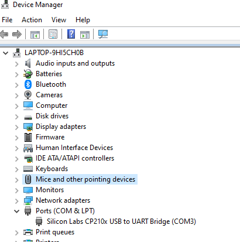

# ultra-shambo

## TODO

### Apka **G +H**
- postawić apke **G**
- logowanie i rejestracja
- parowania (wysyłanie ssid i hasła do esp)
- ekran wyświetlania odległości (czytanie danych z serwera)
- makiety **M**

### Aźur **L +M**
- konto **L +M**
- postawić serwer **L +M**
- baza danych
- endpointy (logowanie, rejestracja, get danych, post danych)

### ESP **H M**
- stawianie WiFi, odbiernie passów, podłączanie się do wifi
- szczytywanie danych z czujnika **H**
- wysyłanie danych do Aźura 


## Setting up micropython and esp32  
[Source tutorial](https://lemariva.com/blog/2020/03/tutorial-getting-started-micropython-v20)

### Requirements
- node.js
- python >= 3.6
- vscode

### Micropython 
#### Configure virutal environment

1. `python -m venv .esp-venv`
2. `pip install -r ./esp-requirements.txt`
3. install pymakr extension (you **must** have node.js)

### Esp  
1. Connect the device
2. Check device manager, if it does not look like the screen the go to 2a  
  
2a. Copy "CP210x_Universal_Windows_Driver.zip" (in esp) to some place on your computer and unzip it.    
      Right click the connected device, and click something about updating drivers.  
      Follow the window, choose manual setting and point to the copied directory.  
1. Find out the port (on the screen its COM3)
2. Flash the devices memory and install new firmware (COMx should be your port):   
  turn on venv: for Win `.\.esp-venv\Scripts\activate ` for Linux `source ./.esp-venv/bin/activate`   
  ```python -m esptool --chip esp32 --port COMx erase_flash```   
  ```python -m esptool --chip esp32 --port COMx --baud 460800 write_flash -z 0x1000 esp\esp32-20220618-v1.19.1.bin```   

### Merging  
1. Open pymakr global config (should be optional, project config in pymakr.conf, check only address):  
    set address to your port COMx    
    set autoconnet to false  
    set sync_folder to micropython  

## Development
1. Turn on vscode with pymakr on
2. Develop files in micropython directory
3. Use upload button to upload micropython directory to the esp

## How to run
1. Connect gnd cable to GND port, Vcc cable to 5V port, trig cable to port 18, echo cable to port 19
2. Connect ESP with your computer by a micro USB cable
3. Run VSCode, if everything is setup right PyMakr console should print `>>>`
4. In PyMakr console enter 
   `import app`
   `app.run()`


## Esp resources
- https://docs.espressif.com/projects/esp-idf/en/latest/esp32/hw-reference/esp32/get-started-devkitc.html
